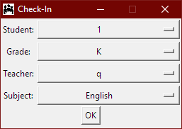

# Check-In
### Requires Python 2.7

This program is used to record the time, grade, and name of students arriving for tutoring as well as the subject that they are being tutored in.

Enter the names of students, teachers and subjects in `data.csv`.

The application can be used by running `main.py`
Alternatively a Windows Installer package can be located in the `Installer` directory, however using the python script is recommended. 

The student records will be placed into the `checkins.csv` file in the format: 

|Student | Grade | Subject | Time|
---------|-------|---------|------
|Student 1 | 9| Calculus | 9/26/18 14:45:02|

## Screenshots

